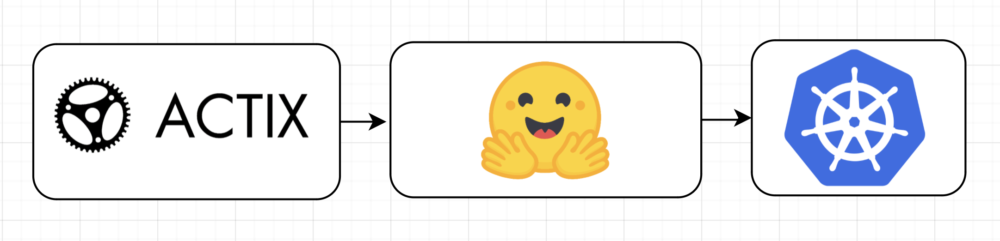

[](https://github.com/szheng3/rust-individual-project-2/actions/workflows/tests.yml)
[](https://github.com/szheng3/rust-individual-project-2/actions/workflows/release.yml)
[](https://github.com/szheng3/rust-individual-project-2/actions/workflows/lint.yml)
[](https://github.com/szheng3/rust-individual-project-2/actions/workflows/rustfmt.yml)
[](https://github.com/szheng3/rust-individual-project-2/actions/workflows/publish.yml)
[](https://github.com/szheng3/rust-individual-project-2/actions/workflows/bench.yml)

# Individual Project 2 - Rust micro-server for Text Summarization

This project aims to build a Rust micro-server that summarizes text, based on the common task of reading and summarizing books among students. The project uses the `rust actix` and `libtorch` to run a pre-trained `hugging-face` model for summarization.

## Project Goals/Outcomes

* Develop my Rust micro-service with kubernetes
* Use Github Codespaces and Copilot
* Integrate libtorch and 'hugging-face pretrained models' into a Rust web project

## Architectural Diagram


## Demo
* [https://apiv2.sszzz.me](https://apiv2.sszzz.me)
  


## Kubernetes Deployment
* go to the directory `K8s`
```
cd K8s
```

* create the namespace `resume-prod`
```
kubectl create namespace resume-prod

```
* apply the yaml files
```
kubectl apply -f .
```


## Docker(Recommended)

* This repo main branch is automatically published to Dockerhub with [CI/CD](https://github.com/szheng3/rust-individual-project-2/actions/workflows/publish.yml), you can pull the image from [here](https://hub.docker.com/repository/docker/szheng3/sz-rust-ml/general)
```
docker pull szheng3/sz-rust-ml:latest
```
* Run the docker image.
```
docker run -d -p 8000:8000 szheng3/sz-rust-ml:latest
```

## Setup Manually

1. Install rust via [rustup](https://rustup.rs/)
2. Install the libtorch (for Mac M1), Intel chips users can skip this step
3. node 
```
brew install pytorch@1.13.1
```


## Not Mac ARM chips users
* Build frontend
```
make frontend 
```
* Run, you can run the rust web app.
```
make run 
```

* Release
```
make releasex86
```

* Bench
```
make benchx86
```

## Mac ARM chips users
* Build frontend
```
make frontend 
```
* change the path in the Makefile to your libtorch path
```
export LIBTORCH=/opt/homebrew/Cellar/pytorch/1.13.1 &&export LD_LIBRARY_PATH=${LIBTORCH}/lib:$LD_LIBRARY_PATH
```
* Run, you can run the rust web app.
```
make runarm 
```
* Release
```
make release
```
* Bench
```
make bench
```


## CI/CD

Github Actions configured in .github/workflows


## GitHub releases
The binary could be downloaded from the release pages. [release](https://github.com/szheng3/rust-individual-project-2/releases)

## Benchmark Results

## Logging


## Progress Log

- [x] Configure Github Codespaces.
- [x] Initialise Rust project with pretrained model from [hugging-face](https://huggingface.co/transformers/model_doc/bart.html)
- [x] CI/CD with Github Actions
- [x] Tag and Releases
- [x] Benchmark
- [x] kubernetes deployment
- [x] logging

## References


* [rust-cli-template](https://github.com/kbknapp/rust-cli-template)
* [rust-bert](https://github.com/guillaume-be/rust-bert)